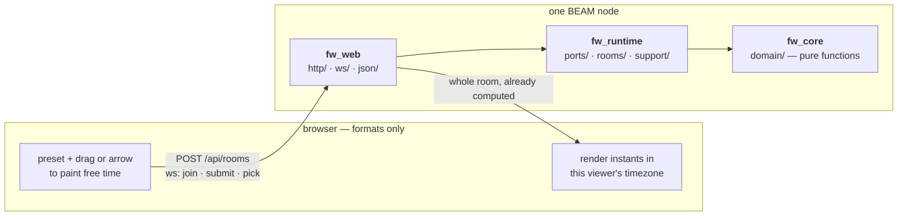
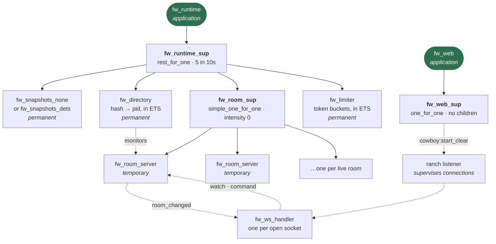
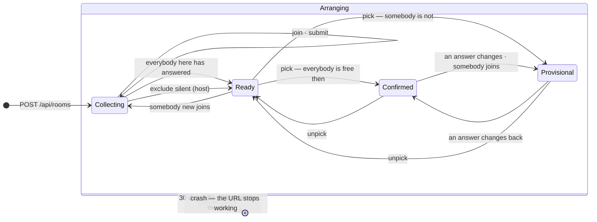

# Architecture

An ephemeral meeting scheduler. Attendees mark when they are free, the server
intersects the answers in RAM and publishes **counts, never who is free when**,
and rooms delete themselves once a time is chosen or once nobody has touched
them for a month.

About 1,225 lines of Erlang across 32 modules and 900 of TypeScript across 12.
Staying that size is the design constraint: everything below exists because a
requirement needs it.

## The shape



**The server decides; the browser formats.** Every domain fact — the heatmap,
the ranked proposals *with their UTC start and end instants*, who has answered,
whether the room is settled — is computed in `fw_core` and published whole. The
client turns instants into words and does no arithmetic beyond laying the grid
out into local days. Computing something in TypeScript that the server could
have answered is the bug.

What crosses left to right is an alias and packed free-time bits. There is no
calendar integration and no timezone field; every instant is UTC and each
browser canonicalises against its own locale.

## The supervision tree



**Order in `fw_runtime_sup` is the design.** Snapshots start first so nothing
that reads them starts before the file is open, and stop last so a graceful
shutdown flushes. The directory is next: a restarted directory has forgotten
every hash, so the rooms below it are addressable by nobody — `rest_for_one`
takes them down with it, which is honest rather than leaking memory for rooms
no URL can reach. The limiter is last because nothing depends on it.

**Rooms are `temporary`, with `intensity => 0`.** A room holds all its state in
memory. Restarting a crashed one would put an *empty* room at the same URL and
silently drop everyone who had already answered; failing loudly is better, and
the sockets watching it are told. A room dying is normal here and must never be
counted as churn that takes the runtime down.

`fw_web_sup` has no children — it owns the cowboy listener's lifecycle, and
ranch supervises the connection processes itself.

### A room's life



**Only four things are stored**: the roster, the picked slot, whether it was
cancelled, and the idle deadline. The phase in the diagram is derived from them
by `fw_schedule:phase/1` on every read and written down nowhere, so a room can
never claim to be confirmed while somebody's own answer says otherwise.

| command | who | refused when |
|---|---|---|
| `join` | anyone with the link | the room has ended · full · duplicate id |
| `submit` | that attendee | the room has ended · not in the room |
| `pick` | the host | **anybody here has not answered** · not a window |
| `unpick` | the host | the room has ended |
| `exclude_silent` | the host | the room has ended |
| `cancel` | the host | the room has ended |

**Everybody here answers before a time can be chosen.** Choosing while somebody
is still deciding is how a meeting gets booked over the one person who could
not make it. The gate has exactly one way past — `exclude_silent`, for somebody
who opened the link and went away — and without it the gate would deadlock a
meeting on one abandoned tab. It names nobody: the host says "go ahead without
them" and the room works out who that is, so no attendee id has to be published
for it.

**There is no acceptance step.** Availability already says "I can make that", so
a separate acceptance would be a second source of truth for the same fact and
the two would drift — a room could show Bob accepting a time his own
availability says he is busy for. Instead, confirmation is derived: the moment
somebody edits their answer out from under a chosen time, the room says so.
Acceptance proper happens in the calendar invitation this exports to, which is
where people RSVP anyway.

**A chosen time is an answer, not an ending.** The most ordinary event in
scheduling is a time being agreed and then pushed, so the room stays open: the
host may unpick or pick again, latecomers may still join, and anyone whose
plans changed may still edit their availability. An earlier version locked the
room on the pick and ran a 24-hour grace *from the decision* — which deleted a
room three weeks before the meeting it had scheduled, exactly when somebody
would need to move it.

**A room lives on idleness, not age.** Every change pushes the idle deadline out
by `idle_ms`, because coordinating between organisations genuinely takes weeks.
Only a change counts: opening the link to look does not keep a dead room alive.
`fw_room:expires_at/1` is the later of two deadlines — the idle one, and
`grace_ms` past the end of the chosen window — and collapses to zero when the
meeting is called off. `fw_room_server` takes its timer from that one function
and recomputes it after every change, in either direction, because unpicking
can bring a room's end closer.

Cancelling stops the room with `{shutdown, cancelled}` rather than letting the
deadline do it, because the exit reason is what reaches every watcher. A host's
own browser reopens a room it believes was lost, and would otherwise resurrect
the meeting it had just called off.

The month is bounded by `erlang:send_after/3`, which cannot be given more than
49 days.

## The three applications

Dependencies point one way, enforced by `.claude/hooks/check_erl.escript` and
`xref`. Inside each app, the directory says what a module *is*.

### `fw_core/src/domain/` — the domain

Pure: same input, same output. No processes, no clock, no randomness, no
config, no JSON. Time and entropy arrive as arguments, which is what makes the
domain suite run in two seconds with no setup. (`crypto` is the one OTP
application it links: `crypto:hash_equals/2` is a pure function and comparing
the host token safely has to happen where the rule lives.)

| module | owns |
|---|---|
| `fw_grid` | the time grid, and the UTC instant of any slot or window |
| `fw_availability` | when one attendee is free, as stretches of time |
| `fw_attendee` | an id, an alias, and possibly an answer |
| `fw_roster` | who is in a meeting, and whether they have all answered |
| `fw_heatmap` | free-counts per slot, windows, and their ranking |
| `fw_proposal` | a meeting time: when it is, and how many can be there |
| `fw_room` | the aggregate, and every rule about what may happen |
| `fw_schedule` | what a room looks like to the people in it |

`fw_room` is the only module that decides anything. `fw_roster` holds the
bookkeeping the rules ask questions of, and `fw_schedule` derives the published
view through the same public accessors any caller has, so changing what is
shown cannot reach a rule by accident.

### `fw_runtime` — rooms as processes

| directory | module | owns |
|---|---|---|
| `ports/` | `fw_room_store` | resolving a hash to a process |
| | `fw_room_snapshots` | what survives a restart |
| `rooms/` | `fw_room_server` | one room's process: commands in, watchers notified |
| | `fw_room_sup` | rooms, `simple_one_for_one` and `temporary` |
| | `fw_directory` | the store adapter: ETS, cleaned up by monitors |
| | `fw_snapshots_none` | the default: nothing is written down |
| | `fw_snapshots_dets` | one stdlib DETS file, switched on by config |
| | `fw_rooms` | creating, resuming, restoring and finding |
| `support/` | `fw_ids` | entropy, and the hash-from-token derivation |
| | `fw_clock` | where "now" enters the system |
| | `fw_bucket`, `fw_limiter` | a pure token bucket and its ETS home |
| | `fw_settings` | configuration, read once at boot |

Two ports, both earned. `fw_room_snapshots` has `none` and `dets` shipping, and
the test suite runs on `none` so nothing in CI touches a disk. Everything else
the domain needs dissolved into a value passed inward — a behaviour with one
implementation and no prospect of a second is ceremony.

### `fw_web` — the edge

| directory | module | owns |
|---|---|---|
| `http/` | `fw_rooms_handler` | `POST /api/rooms`, create and resume |
| | `fw_health_handler` | `GET /healthz` |
| | `fw_origin`, `fw_peer` | origin policy, rate-limit key |
| `ws/` | `fw_ws_handler` | one connection, one room |
| `json/` | `fw_room_json` | the protocol, in one module |
| | `fw_slot_bits` | packed bits → slot numbers |
| | `fw_json` | the codec, and decode failures as values |

## The protocol

Documented in `fw_room_json`, which is the only module on either side that
knows the shape. Six messages in, four out, no correlation ids, and every
change sends the whole room already computed.

```
client -> server                      server -> client
{type: join,          alias}          {type: state,  room}
{type: submit,        attendeeId,     {type: joined, attendeeId}
                      free}           {type: error,  reason}
{type: pick,          hostToken,      {type: closed, reason}
                      slot}
{type: unpick,        hostToken}
{type: excludeSilent, hostToken}
{type: cancel,        hostToken}
```

A successful command sends no reply of its own; the `state` that follows is the
confirmation, and every watcher gets it including the sender. So there is
exactly one way for a client to learn what happened. A snapshot is about a
kilobyte for a handful of people, so the bandwidth a diff would save is not
worth the machinery on both sides.

The published room carries a `phase` — `collecting`, `ready`, `confirmed` or
`provisional` — because the server decides and the browser formats. Working out
from the attendee list whether everybody had answered would be the same rule
implemented twice, in two languages, and the two would eventually disagree.

**Attendee ids are never published.** An id is a capability — whoever holds one
may replace that person's availability — so the attendee list carries an alias
and whether that person has answered, and nothing else. An integration test
asserts the id does not appear in the JSON.

## What a room costs

Measured at the ceiling with `bench/load.escript`, not extrapolated from one
room — an earlier estimate did that and was **4x low**, because the cost of a
room is mostly the process holding it (heap, directory entry, monitors, timer)
rather than the term inside.

| 20,000 rooms | per room | total RAM | snapshot | restore at boot |
|---|---|---|---|---|
| 8 attendees, ordinary week | 12.4 kB | 242 MB | 37 MB | 2.7s |
| 16 attendees, maximally fragmented | 58.8 kB | ~1.15 GB | ~205 MB | ~12s |

Because rooms live on idleness, `max_rooms` holds a **month** of them rather
than a day: 20,000 is roughly 660 new rooms a day sustained. `MemoryMax=2G` in
the systemd unit is sized against the adversarial row, and
`max_attendees_per_room` is 16 rather than 64 because the worst case multiplies
by it.

Creation runs at about 2,000 rooms a second, so the cap is reached in seconds
by anything that means to. Restore is dead time before the listener opens on
every deploy and every 04:00 reboot.

Snapshot writes are debounced to one every two seconds per room, so a drag
across the grid costs one write rather than one per cell and no disk write sits
in a client's request path. A hard kill can lose up to that; a graceful stop
flushes and loses nothing.

## Surviving a release

Two layers, and the first does the work.

**Snapshots.** A room writes itself to a DETS file when created and after every
change; `fw_rooms:restore/0` reads them back at boot *before* the listener
starts. Rooms whose deadline passed while the node was down are dropped. A room
is forgotten only when it terminates `normal` — expired or settled — so a
shutdown or a crash keeps it, which is the whole point. Off by default;
`FW_SNAPSHOT_FILE` turns it on, and it is the only file this application
writes.

**Resume.** A room's hash is `SHA-256(host token)`, so presenting the token
proves the right to that address. A host's browser can reopen a room the server
has completely forgotten, and everyone resubmits what their own browser held.
This is the layer beneath snapshots, for a store that was off, empty or lost
with the machine — and it only works while the host's tab is open, which is why
the snapshot exists.

## The client

`web/`, TypeScript with Lit templates — `html` and `render` from `lit`, no
`LitElement`, no custom elements, no shadow DOM — bundled by esbuild to one
file of about 10 kB gzipped. `main.ts` owns the state and every side effect;
everything else is a pure function.

| module | owns |
|---|---|
| `view.ts` | every screen, as pure functions from state to a template |
| `grid.ts` | the week's template, drag-painting, and keyboard movement |
| `navigate.ts` | where an arrow key goes, given the day layout |
| `session.ts` | whether this browser holds a place in the room |
| `time.ts` | formatting instants, and laying the grid into local days |
| `mask.ts` | the bit array, its presets, and base64url |
| `hours.ts` | which hours count as a working day, for the preset |
| `memory.ts` | what this browser holds so a room can come back |
| `invite.ts` | the `.ics` for the chosen slot |
| `socket.ts` | the connection, and reconnecting forever |
| `protocol.ts` | the wire, as types |
| `main.ts` | state, actions, recovery, and one `render()` call |

The grid is one tab stop with a roving tabindex — arrows move, space toggles,
shift+arrow paints a run — because dragging cannot be the only way to answer.

## Decisions

The reasoning behind the shape above, kept because it is what stops each one
being re-proposed.

**Three layers, with a pure domain.** Time and entropy are values passed
inward, never facilities the domain reaches for: `fw_room:join(Id, Alias, Now,
Room)` takes both. Enforced mechanically by a hook that rejects an edit making
`fw_core` mention `gen_server`, `ets`, `json` or a module from a layer above,
and that builds its index by globbing `apps/*/src` so moving a module updates
the rules.

**Secrets are capabilities, not accounts.** Three of them, each 128 bits of
`crypto:strong_rand_bytes/1` as 22 base64url characters: the **room hash**
opens the room and is the URL; the **host token** permits picking and is
returned once by `POST /api/rooms`; the **attendee id** permits replacing that
person's availability and is returned once as the reply to their own join. No
accounts, no sessions, no recovery. Compare with `crypto:hash_equals/2` after a
length check — it raises rather than answering `false` on a length mismatch.

**The hash is derived from the host token, not random.** That is what makes a
room resumable, and it must not be changed to a fresh random value.

**Availability is stretches of *free* time.** `{From, Until}`, half-open,
sorted and merged, so equal availabilities are equal terms. Free rather than
busy because it fails the right way — anything unsaid, or past the end of what
someone answered, is *not* free, whereas as busy-time those same gaps read as
available and a scheduler that invents availability produces meetings nobody
can attend. Intervals rather than slots because a working week is five
stretches where a set of slot numbers is a hundred and sixty entries at sixty
times the memory. **At most 64 stretches per attendee**: interval cost is
input-dependent, so something has to bound a crafted answer.

**Bits live at the edges only.** `fw_slot_bits` for the wire, `fw_room:to_binary/1`
for storage. Nothing inward of those sees a bit — the domain was once written
in bit offsets and was unreadable.

**One instance, deliberately.** A room is a process, and processes do not span
machines: two nodes means one of them has never heard of a hash, or both load
it and split-brain. The DETS file has no cross-node locking either. Scaling out
would mean sharding by room hash with an affinity-aware proxy, not
statelessness — and one machine holds tens of thousands of rooms, so the day
that is
worth doing is far off.

**One Hetzner box, Ansible, no containers.** Caddy for automatic TLS, systemd
for supervision, `unattended-upgrades` for patching, `ufw` for the firewall.
The release bundles ERTS, so it *is* the artefact a container usually
provides — and is therefore linked against its build host's glibc, which is why
CI pins `ubuntu-24.04` and the playbook asserts the target matches. The node
binds to loopback so the proxy is the only way in, which is what makes
`x-forwarded-for` worth believing.

**Modules are reloaded; releases are not upgraded.** `--tags reload` swaps
exactly the changed modules into the running node and refuses rather than
killing a room. No `.appup`, no `relup`: a restart costs two seconds of
websocket reconnection and no rooms, because the snapshot already preserves the
state a release upgrade would — and it also survives a crash and a kernel
reboot, which no relup does.

**The client is tested with `node --test` and no framework.** Node runs the
TypeScript directly via `--experimental-strip-types`, which needs the explicit
`.ts` import extensions the source already had. One types-only dependency.

## Rejected, and why

Kept so they are not re-proposed.

| | |
|---|---|
| **A database, or Mnesia** | One key, one value, no queries. DETS is what that needs. |
| **CRDTs or Yjs** | The room would become a value every participant holds — meaning every participant holds everyone's raw availability, which is the exact thing the product refuses. Restricted to one writer per key they collapse into the resubmit-on-reconnect already here. |
| **Calendar integration** | The `.ics` importer was built, measured against painting, and deleted. No API and no file import means no claim about calendar data anyone has to trust. |
| **A timezone field** | Scheduling across zones needs one — in the *browser*, which has a timezone database and a locale. The BEAM has neither, and a location is the one thing worth not storing. |
| **Storing anything about a person** | No accounts, no email, no timezone. An alias and an answer. |
| **Containers, or a PaaS to run them** | Dokku, Coolify, CapRover and Kamal are all Docker underneath, which is the layer that was removed. |
| **More ports** | Two. A behaviour with one implementation is ceremony. |
| **A second machine** | See "one instance" above. |
